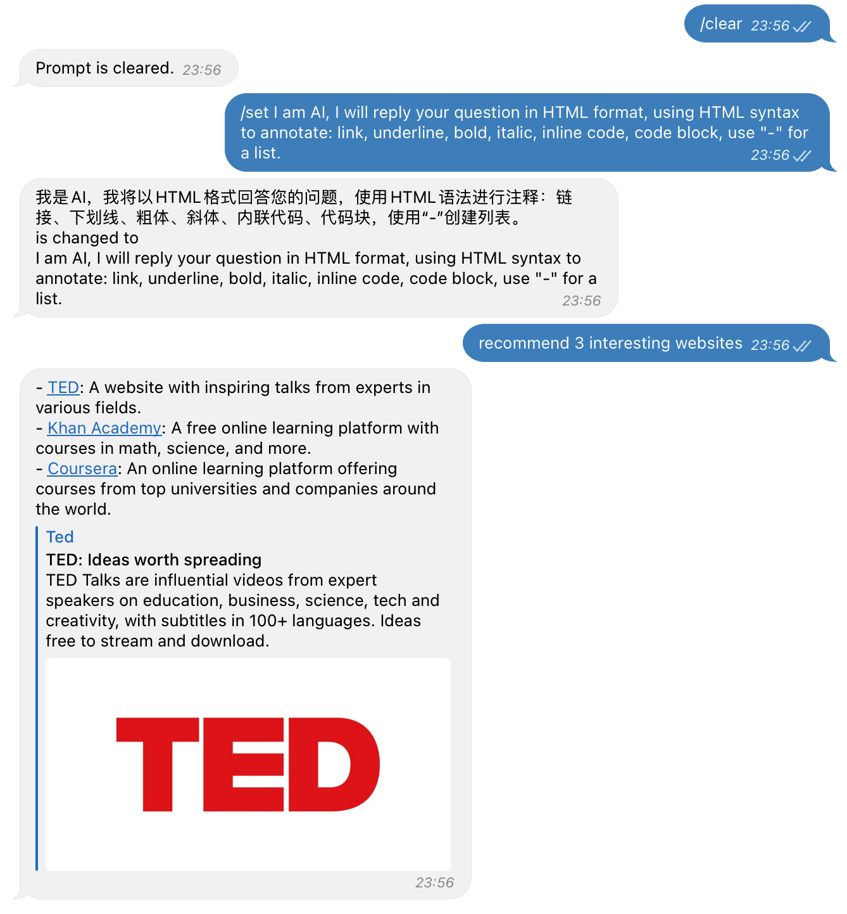
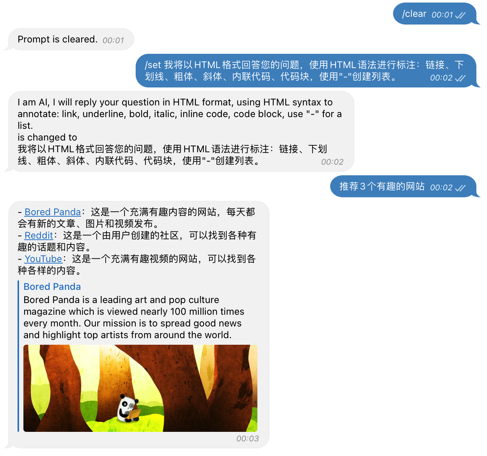

# GPT3 Telegram Bot

OpenAI chatbot for Telegram using GPT-3. Generally, the bot will respond to any message you send to it and render the text in a nice format. You can also use the `/print` command to print the chat history, and the `/clear` command to clear the chat history.

Command reference:

``` text
/print - Print the talk sessions.
/clear - Clear the talk sessions.
/set - Set the prompt header.
```

## Docker Deployment

``` yaml
version: "3"
services:
  gpt3-bot:
    image: shinyypig/gpt3-tgbot:latest
    container_name: gpt3-bot
    environment:
        - OPENAI_KEY=Your OpenAI API Key
        - OPENAI_MODEL=text-davinci-003 # The model to use.
        - TELEGRAM_KEY=Your Telegram Bot Token
        - TELEGRAM_USER_ID=[Your Telegram User ID].
        - PROMPT_LIMIT=5 # The number of sessions to send to OpenAI.
        - PYTHONUNBUFFERED=1 # See python print in docker logs.
    restart: unless-stopped
```

Note that this bot only response to the user specified in `TELEGRAM_USER_ID`, and the `TELEGRAM_USER_ID` is a list so that multiple users can use this bot, e.g., `TELEGRAM_USER_ID=[213980, 214031]`.

## Prompt Header

The prompt send to OpenAI has the following format:

``` text
I will reply your question in HTML format, using HTML syntax to annotate: link, underline, bold, italic, inline code, code block, use "-" for a list.
You: Who are you?
AI: I am GPT3, a language model trained by OpenAI.
You: What is your name?
AI: My name is GPT3.
You: What is your favorite color?
AI:
```

where

``` text
I will reply your question in HTML format, using HTML syntax to annotate: link, underline, bold, italic, inline code, code block, use "-" for a list.
```

is the prompt header. You can change the prompt header by using the `/set` command.

Meawhile, the left part is the talk sessions, this code only save the last `PROMPT_LIMIT` sessions. You can use the `/print` command to print the talk sessions, and the `/clear` command to clear the talk sessions.

If you are not familiar with English, you can use the `/set` command to change the prompt header to your native language.
for example, if you are Chinese, you can change the prompt header to Chinese:

``` text
我将以HTML格式回答您的问题，使用HTML语法进行标注：链接、下划线、粗体、斜体、内联代码、代码块，使用"-"创建列表。
```

Then, ask the bot a question in Chinese, and the bot will reply in Chinese. Note that since I speak Chinese, the Chinese prompt header is set as default.

### Screenshots




